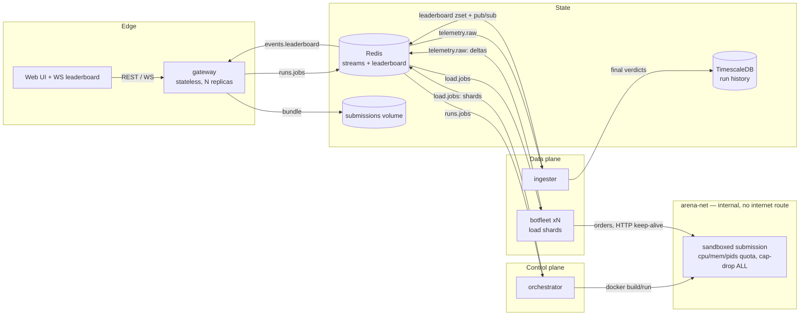
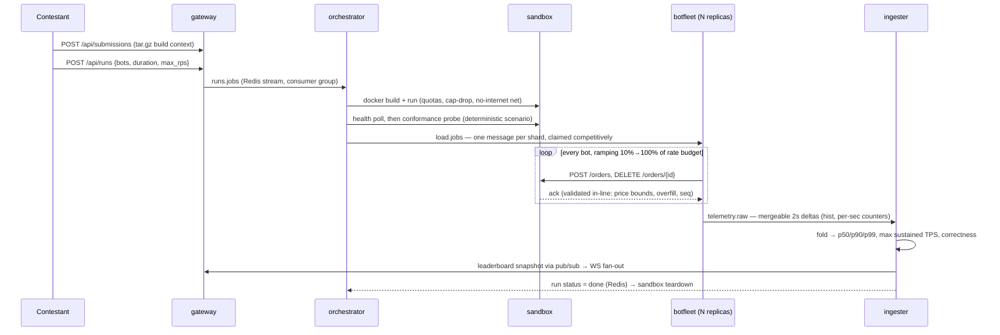

# Architecture Blueprint



## Run lifecycle



States: `queued → building → conformance → load → done | failed`.

## Components

| Service | Role | Scaling model |
|---|---|---|
| **gateway** | Uploads, run control, leaderboard REST + WebSocket fan-out, static UI | Stateless; N replicas behind any L4 LB. WS clients all receive the same pub/sub feed, so no session affinity needed |
| **orchestrator** | Build → sandbox → conformance → shard fan-out → teardown | Consumer group on `runs.jobs`; add replicas for parallel runs |
| **botfleet** | The load generator: claims shards, runs bots, validates acks in-line, ships telemetry deltas | The horizontal axis of the platform: shards are claimed competitively from `load.jobs`, so `--scale botfleet=32` (or the k8s HPA) raises aggregate attack capacity with zero coordination |
| **ingester** | Folds deltas, computes percentiles/TPS/correctness, owns the verdict, archives to Timescale | Consumer group; per-run state is small (sparse histogram + counters) |

## Key decisions

**Redis Streams over Kafka.** Consumer groups give at-least-once delivery,
competitive claim, and replay — everything the job/telemetry buses need — in
a single dependency we already use for the leaderboard. Message rates are
modest by design (telemetry is pre-aggregated into 2s deltas per shard, not
per-order events), so a Kafka deployment buys operational weight, not
headroom. The bus is isolated behind three stream names; swapping in
Kafka/Redpanda is a transport change, not a redesign.

**Telemetry as mergeable deltas, not raw events.** Per-order events at 50k
TPS would make the metrics pipeline the bottleneck of the thing measuring
bottlenecks. Instead each shard folds latencies into a log-bucket histogram
(5% geometric buckets → quantiles within ±2.5%, ~hundreds of counters) and
ships *deltas* every 2s. Merging is commutative addition, so the ingester is
order-insensitive and a shard's worth of telemetry costs bytes, not
megabytes. Throughput is tracked as per-second ack counts, letting the
ingester find the **max sustained TPS**: the best one-second window whose
error rate stayed under 1%.

**Correctness on the hot path + a deterministic oracle.** Two layers:
1. *Live invariants*, checked by every bot on every ack: id echo, overfill,
   limit-price bounds on fills, status/fill consistency, per-observer
   sequence monotonicity. Free, and scales with load.
2. *Conformance probe*, run by the orchestrator before load: a fixed
   scenario (equal-price time priority, partial fills, IOC market sweeps,
   cancel semantics, rejects) replayed against `internal/matching` — the
   platform's reference book — and diffed ack-by-ack, fill-by-fill.

**docker CLI over the Go SDK** in the orchestrator: the CLI is the stable,
audited interface to the daemon; the SDK's type surface churns across major
versions. Sandboxing flags are explicit in one place and `exec`-d verbatim.

**Integer ticks** in the order protocol: float prices make "did the engine
respect price-time priority" unanswerable at the boundary. 1 tick = 0.01.

## Isolation

Submissions are hostile by assumption. Each sandbox runs with:

| Control | Setting |
|---|---|
| CPU quota | `--cpus 1.0` (fair benchmarking as much as safety) |
| CPU pinning | `--cpuset-cpus N` — each submission is pinned to one core, chosen by a stable hash of its id, so concurrent benchmarks run on different cores and don't contend for the same L1/L2 or scheduler queue. Makes latency numbers repeatable and comparable across submissions |
| Memory | `--memory 512m` |
| Fork bombs | `--pids-limit 256` |
| Capabilities | `--cap-drop ALL`, `--security-opt no-new-privileges` |
| Filesystem | `--read-only` + 64 MB tmpfs on `/tmp` |
| Network | `arena-net`: an `internal` Docker network — bots and orchestrator can reach the engine, the engine cannot reach the internet or the control plane (Redis, Timescale, the socket) |
| Lifetime | force-removed (and image deleted) on verdict, failure, or timeout |

Equal quotas double as fairness: every submission gets the same silicon.

On Kubernetes the demo manifests use a DinD sidecar; the production path is
Kubernetes Jobs under a gVisor (`runsc`) RuntimeClass + NetworkPolicy, which
removes the privileged sidecar entirely. The orchestrator only assumes
"docker-compatible endpoint", so this is a deployment change.

## Resilience & failure modes

| Failure | Behavior |
|---|---|
| Submission doesn't build / never healthy | Run fails with the build/log tail surfaced to the UI; sandbox torn down |
| Engine crashes mid-bombardment | Bots record connection errors (counted per second); verdict still lands with the TPS the engine sustained before dying |
| Fleet replica dies mid-shard | Shards are acked on claim (at-most-once, by design: redelivery would double-count telemetry). Lost shard = less offered load; the ingester's stale sweep (60s silence) finalizes the run with partial data |
| Ingester restarts | Telemetry stream is durable; consumer group resumes. In-flight aggregates for active runs are rebuilt from subsequent deltas; the stale sweep bounds the damage |
| TimescaleDB down | Verdicts unaffected — Redis is the source of truth for the board; Timescale is best-effort analytical history |
| Redis down | The platform is honest about this SPOF: it's the bus and scoreboard. Production: Redis Sentinel/Cluster |
| Orchestrator killed mid-run | Sandbox containers carry `arena.run` labels; `make clean` (or a reaper cron) sweeps orphans |

## Data stores

- **Redis** — streams (`runs.jobs`, `load.jobs`, `telemetry.raw`), run/submission
  hashes, leaderboard zset (best run per submission), snapshot key, pub/sub
  channel for WS fan-out.
- **TimescaleDB** — `arena_runs` hypertable: one row per finished run, for
  history, Grafana, and post-hoc analytics.
- **Submissions volume** — content-addressed-ish tarballs (`<id>.tar.gz`),
  shared gateway ↔ orchestrator. S3/GCS in production.

## Scoring

```
score = 100 × (0.35·latency + 0.35·throughput + 0.30·correctness)
latency     log-linear on p99: ≤1ms → 1.0, ≥1s → 0.0
throughput  log on max sustained TPS: 50k saturates
correctness ½ live invariant rate + ½ conformance probe
```

Log scales because trading-system quality is multiplicative: 1ms→2ms matters
as much as 100ms→200ms. Weights are constants in `internal/score` and can be tuned for required scoring.
